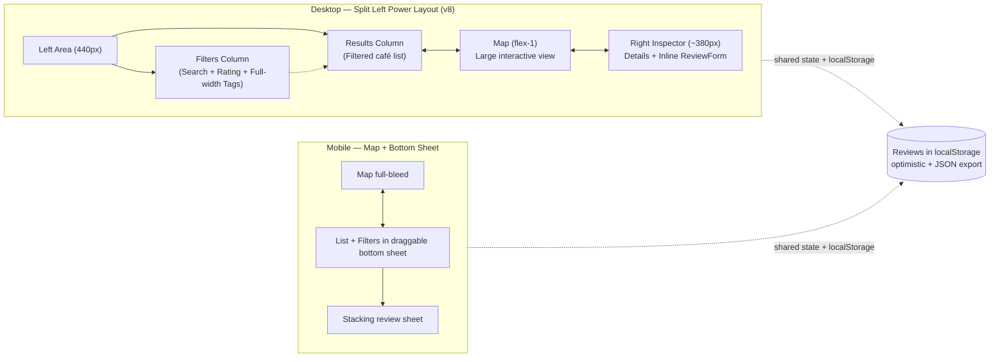

# UX Specification: Gumi Cafe Map — Calm, Fast Personal Cafe Memory

**Date:** 2026-05-23  
**Status:** Ready for ui-designer (post ux-explorer research)  
**Prepared by:** ux-designer persona (per `.grok/personas/ux-designer.toml` instructions)  
**UX Priority #1:** "Review more, think less." Every action is obvious, reversible, and completes a meaningful personal log in under 10 seconds with zero friction. Calm minimalism, bidirectional map↔list sync as the hero delight, private by default.

---

## Executive Summary

Gumi Cafe Map is a private, zero-backend web notebook for a local resident to discover, remember, and quickly log personal cafe visits in Gumi (구미) on an interactive map. The experience centers on instant bidirectional synchronization between a calm map and a scannable list, paired with a thumb-friendly review capture flow that lets users rate + note + tag in 3–5 taps. No accounts, no photos, no social features, no gamification—just your memories, beautifully and speedily preserved.

**Success Metrics (v1, measured in real use)**
- Time-to-log: median < 8 seconds from opening the app (or spotting a cafe) to "Saved ✓" confirmation with visible update on both map and list.
- Time-to-first-review: < 20 seconds on first visit (including discovery).
- Perceived speed & calm: users describe it as "instant" and "peaceful" in qualitative feedback; zero "did it save?" anxiety.
- Return visits: high weekly retention because it feels like a trusted personal notebook, not a task.
- Accessibility: 100% keyboard + screen-reader operable core flows; no accessibility blockers reported in manual + automated checks.

All decisions below exist to protect these metrics. Anything adding a click, a load, or cognitive noise is rejected.

## Target User & Context

A busy Gumi local (20s–40s) who visits 2–3 cafes per week for work, meetings, dates, or solo time. They value remembering the "quiet corner with good oat lattes" or "great power outlets for long study sessions" without spreadsheets, scattered notes, or public sharing. They open the app on phone while walking or on desktop at home to plan or reflect. Context: private, low-stakes, aesthetic appreciation of local places. Speed and glanceability trump features.

## Information Architecture & Navigation

**Core principle:** On desktop, prioritize power and context — filters + results + map + review all visible at once with minimal navigation. On mobile, prioritize the map as the primary surface with list and review in sheets. Selection is the unifying interaction. Filters are always live and affect both map and list. URL params keep filters shareable.

### Desktop (≥1024px) — Power Layout (v8)
- **Left area (~440px wide)**, split into two vertical columns:
  - Filters column (~190px): Search, Min Rating pills, full-width selectable Tags (own constrained scroll if content grows)
  - Results column: wrapper uses `flex flex-col h-full min-h-0`; non-growing header ("Results • N", subtle border-b for separation) always pinned/visible above the list; dedicated inner `<div class="flex-1 overflow-y-auto ...">` holds *only* the café cards (space-y-2 or .cafe-card list). The count header never scrolls away.
- **Center**: Large, dominant interactive map (Leaflet)
- **Right Inspector panel (~380px)**: When a café is selected, shows details + the full ReviewForm inline (stars, note, tags, save) — no overlay needed on desktop
- Bidirectional sync: Selecting from results or map highlights the other and populates the right inspector
- Filters are persistent and scoped to the left filters column
- **Main grid + pane constraints**: Use `lg:h-[calc(100dvh-4rem)]` (or `100svh`) + `overflow-hidden` on the root grid for viewport-robust height (better than 100vh under browser chrome/zoom). Mandate `min-h-0` (plus `overflow-hidden` on the hosting flex/grid cell where needed) on the left `lg:flex-row` container and every scroller-hosting pane. This propagates height correctly so the inner `flex-1 overflow-y-auto` receives real remaining space via flexbox (standard antidote to `min-height:auto` default on flex items).

The exact structure and classes follow the visual contract in `docs/mockup-v8-desktop-split-left.html:172-177` (Results `flex-1 flex flex-col` > border-b header > `flex-1 overflow-y-auto` scroller), which was the approved v8 direction but not fully ported to the React implementation. Reference that HTML as the binding layout spec for the Results area.

### Mobile / Tablet (<1024px)
- Map remains the primary full-bleed surface
- Café list lives in a persistent, draggable bottom sheet (peek → medium → full)
- Tapping a marker or list item opens a stacking review sheet over the list sheet
- Filters are available inside the list sheet when expanded
- Graceful collapse of the desktop split layout (left sidebars become drawers, right panel becomes sheet)

**Implementation constraints for constrained-height panes**

To achieve reliable inner scrolling in the flex/grid side panels (without body-level overflow, cut-off cards, or lost count header) — essential for desktop users to scan the full filtered results list at a glance:

- Root grid (lg): `h-[calc(100dvh-4rem)] overflow-hidden` (or equiv. using `100svh` / `100dvh` for robustness vs. browser UI chrome).
- Left flex container (`lg:flex-row`): `h-full min-h-0` (mandatory; grid cell also benefits from `min-h-0`).
- Results wrapper: `flex flex-col h-full min-h-0`
- Results header row: non-growing (static height, `border-b` optional for calm separation per mockup).
- Inner results list: `flex-1 overflow-y-auto` (only cards live here).
- Apply analogous `min-h-0` + `flex-col` / inner scroller to Filters pane if its content (tags) ever needs it.

This is the precise pattern from the v8 mockup visual contract (`docs/mockup-v8-desktop-split-left.html:172-177`) and the standard solution for Tailwind flex scrolling panes. The `min-h-0` defeats the flex item's `min-height: auto` intrinsic-size lock that was causing the reported overflow.

**Why this supports UX priority #1 ("Review more, think less")**: Users can now reliably scroll and scan any number of results (all 10 seed cafés or filtered subsets) on any viewport height while the "Results • N" count and filters remain visible and interactive. No friction, no cognitive load from broken layout, direct enabler of the fast discover → tap → review <10s flow on the flagship desktop split view. Keeps the experience peaceful and personal. No design tokens added; pure layout classes + existing .cafe-card.

**Mermaid IA Diagram (v8 Desktop Power)**



URL-driven filters: `?q=latte&min=4&tags=quiet,wifi` (applied to both results list and map markers)

## Primary User Journey (Discover → Select → Log → See Everywhere, < 10s / < 8s happy path)

1. Open app (or return) → map/list loads instantly from localStorage + seed (Gumi center ~36.1136,128.336, zoom 14). 10–15 cafes visible.
2. Scan: either pan/zoom map or scroll list (filters narrow both live).
3. Select: 
   - Map: tap large, high-contrast marker → map stays, list scrolls/highlights matching card.
   - List: tap card → map flies smoothly to marker (or instant on reduced-motion), card highlights.
4. Review sheet/panel opens automatically with café name as clean semantic title (prominent heading) + warm invitation ("Your memory" or "Capture your memory here").
5. Log (3–5 actions):
   - Tap star (1–5) — immediate visual fill, no submit yet.
   - (opt) Type 1-line note or tap 2–3 tag chips.
   - Tap primary "Save memory".
6. Instant feedback: optimistic update — marker changes color/tint to reflect avg or "reviewed", list card updates stars + tags + "last logged", polite toast "Saved ✓", panel can stay or collapse gently.
7. See sync: switch to other view or filter — change is everywhere. Data persisted.

**Total taps on mobile happy path:** 3 (star + 1 tag + save) to 5. Median time <8s once familiar. No spinners, no page loads, no modals that trap.

**Mermaid Primary Flow (simplified happy path)**

```mermaid
sequenceDiagram
    participant U as User
    participant App as Gumi Cafe Map (React)
    participant Map as Leaflet MapView
    participant List as CafeList + Filters
    participant Form as ReviewForm (sheet/panel)
    participant Store as localStorage + State

    U->>App: Open / return visit
    App->>Store: Load reviews + seed cafes
    App->>Map: Render markers (colored by review status)
    App->>List: Render cards (filtered)
    U->>Map: Tap marker (or List: tap card)
    Map-->>App: onSelect(id)
    App->>List: highlight + scrollIntoView
    App->>Map: flyTo (respect reduced-motion)
    App->>Form: Open bottom/side sheet with cafe details
    U->>Form: Tap 1-5 stars (live)
    U->>Form: (opt) type note or toggle tags
    U->>Form: Tap "Save memory"
    Form->>App: onSave({rating, note?, tags[]})
    App->>Store: optimistic update + persist
    App->>Map: update marker visual (color/tint + reviewed state)
    App->>List: update card (stars, tags, last visit)
    Form-->>U: "Saved ✓" toast (polite live region)
    Note over U,App: <8s end-to-end; bidirectional sync visible
```

## Review Capture Flow — Exact Fields, Order, Microcopy, <10s Journey

**Trigger:** Selection from map or list (pre-fills cafe context instantly — no extra search).

**Container:** 
- Desktop: persistent right or bottom panel (or modal-like but non-blocking side sheet)
- Mobile: bottom sheet (min 44px drag handle, expands to ~70vh max, scroll internal if needed)

**Header (always):** 
The café name is presented **cleanly and prominently** as a semantic heading / title (e.g. `<h2>` or styled equivalent with proper heading semantics for a11y, screen readers, and document outline). A separate, warm, low-pressure invitation follows, such as "Your memory" or "Capture your memory here".

Example (must read naturally for all seed names):
- **퍼블릭커피로스터즈**
  Your memory
- **스타벅스 구미옥계점**
  Capture your memory here

**Rationale and requirements:** This keeps the place name as the respectful subject (no awkward embedding or mangling with English verbs/questions). The invitation is calm and personal, consistent with the app's "your memories" tone and the clean inspector header in the v8 mockup. It directly supports "review more, think less" by making the right panel feel like opening a treasured personal notebook page rather than answering a prompt.

**Explicit requirement:** Microcopy (and its implementation in ReviewForm) must be tested/validated against the actual Korean and mixed-language seed café names in `src/data/cafes.ts` (e.g. '퍼블릭커피로스터즈', '스타벅스 구미옥계점', '이디야커피 구미옥계점', '투썸플레이스 구미산동점' and all others). The name must never be visually or semantically mangled. Proper heading semantics ensure screen readers announce the clean name first.

**Fields — strict vertical order, no overwhelm:**

1. **Star Rating** (required for save, but default 5 or last-used smart default)
   - 5 large tappable stars (48px+ targets on mobile, 40px desktop)
   - Microcopy: none above — just the row of stars. Immediate fill on tap/hover, clear on re-tap if needed.
   - ARIA: "Rating: 4 out of 5 stars" live.

2. **Short note (optional)**
   - Single-line growing textarea.
   - Placeholder: "Loved the quiet corner and oat latte. Will come back for the view."
   - Microcopy above: "Quick memory (optional)"
   - Auto-save draft in session if user starts typing and navigates away (reversible).

3. **Tags (optional, multi-select)**
   - Horizontal or wrapping row of 6–8 large, thumb-friendly chips (min 44×36px).
   - Microcopy: "What stood out?" or "Add tags"
   - Fixed vocabulary (from research, calm & useful for Korean cafes, no overwhelm):
     - WiFi
     - Power / Outlets
     - Quiet
     - Dessert
     - View / Scenic
     - Work / Study friendly
     - Great coffee
     - Cozy / Aesthetic
   - Toggle on tap (selected = filled accent bg, check or bold text). No "add custom" in v1 to protect speed/calm.
   - "Clear tags" subtle link only if any selected.

4. **Actions**
   - Primary: full-width or prominent "Save memory" (accent color, large text, 48px+ height)
   - Secondary: "Skip for now" or "Close" (subtle, does not discard draft if started)
   - On save: optimistic + "Saved ✓" (success green, auto-dismiss 1.2s, live region)

**Smart defaults & speed tricks:**
- Stars default to 5 (or user's most common) — one tap changes.
- Last-used tags for this cafe pre-selected if re-logging.
- Enter key on note or last tag submits if stars chosen.
- All changes live; no "submit form" separate step until Save.
- Reversible: changing rating/tags after save instantly updates everywhere (no "edit" mode needed in v1 — just re-open sheet).

**<10s / <8s journey guarantee:** Pre-selection + large targets + 1 required action (stars) + optional fast chips + big Save = 3–5 gestures max. Research-backed from Mapstr/Wanderlog/Google My Maps patterns adapted for calm personal use.

**Mermaid Review Capture Micro-Flow**

```mermaid
flowchart LR
    Select[Select cafe<br/>map or list] --> Open[Open sheet/panel<br/>Café name (title) + "Your memory"]
    Open --> Stars[Tap stars<br/>(1-5, instant)]
    Stars --> Note[Optional: type note<br/>or skip]
    Note --> Tags[Optional: tap 2-3<br/>tag chips]
    Tags --> Save[Tap "Save memory"]
    Save --> Update[Optimistic:<br/>map marker + list card + toast]
    Update --> Persist[Persist to localStorage<br/>+ sync views]
```

## Edge Cases & Empty States

- **First use / zero reviews:** Hero empty state on list: "Your memories will appear here. Tap any cafe on the map or list to log your first visit." Map shows all seed cafes with neutral styling. "Add your first memory" CTA optional.
- **No results after filters:** "No cafes match — clear filters?" button. Map still renders all (or dims non-matching gently). Live count: "0 of 14 match".
- **Offline:** Fully functional (all in localStorage). Banner "You're offline — changes saved locally" (subtle, polite).
- **Long note:** Textarea scrolls internally; never truncates on save.
- **Re-log same cafe:** Opens with existing review pre-filled (stars + note + tags) for quick update or add.
- **Many reviews:** List virtualized? No — v1 small data (<50 cafes), simple scroll. Later if needed.
- **Delete review:** Long-press or "..." on card → "Remove memory" (confirm gentle, destructive but rare).

## Mobile + Desktop Behaviors (Detailed)

- **Touch:** 44–48px minimum targets everywhere (stars, chips, markers, list rows, buttons). Generous hit areas on map markers (use L.divIcon with padding).
- **Desktop hover/keyboard:** Subtle lift on cards/markers, focus rings high-contrast, arrow keys cycle list, Enter selects.
- **Map interactions:** Pinch zoom, double-tap, drag pan on mobile; wheel + drag on desktop. Click marker always wins over pan.
- **Sync timing:** <150ms visual feedback; flyTo duration 600–800ms (0 on reduced-motion or preference).
- **Filters:** Live on every keystroke/chip toggle — both map markers and list update simultaneously. Count announced.
- **Sheet on mobile:** Spring-like feel (but respect reduced-motion: slide without bounce). Tapping another cafe while sheet open swaps content without full close.
- **Orientation:** Portrait primary; landscape treats as wider desktop split if possible.
- **Performance:** Instant load (<1s on 4G), no heavy JS after initial. Markers render fast.

## Accessibility Requirements (from map-libs-a11y research + calm UX)

- **Keyboard:** Full tab order (filters → list items → map? via landmark → markers via Leaflet keyboard support). Markers have `title` + meaningful aria-label. Stars: radio or roving tabindex + arrows. Esc closes sheet/panel.
- **Screen readers:** 
  - Live regions: `<div aria-live="polite">X cafes match your filters</div>`, "Review for [name] saved", selection changes.
  - List: `<ul role="listbox" aria-label="Cafes in Gumi">` with `<li role="option" aria-selected>`.
  - Map: labeled region, markers descriptive (e.g. "Cafe Name, 4.5 stars, reviewed").
  - Popups: Esc-closable, announced.
- **Visual:** 4.5:1+ contrast (use tokens). High-contrast / forced-colors media queries for markers and states. Focus visible.
- **Motion:** `prefers-reduced-motion` → disable flyTo animation, use setView. Transition times short and purposeful (180ms).
- **Markers (Leaflet):** Use `L.divIcon` with inner text for rating, `aria-label`/`title` on container. Follow Leaflet a11y examples exactly.
- **Testing:** Manual keyboard-only, VoiceOver/NVDA, axe or similar. No traps.
- **Mobile a11y:** Sheet focus trapped sensibly (first focusable is stars), drag handle labeled.

All per research-map-libs-a11y.md guidance: polite announcements, no focus stealing on sync, generous targets.

## Tag Vocabulary (from research-ux-patterns-cafe-apps.md, fixed for v1 calm)

Exactly these 8 (bilingual friendly labels in UI; Korean natural phrasing to be polished by user/ui):

- WiFi (와이파이)
- Power / Outlets (콘센트)
- Quiet (조용함)
- Dessert (디저트 / 케이크)
- View / Scenic (뷰 / 풍경)
- Work / Study friendly (공부하기 좋음 / 작업)
- Great coffee (커피 맛있음)
- Cozy / Aesthetic (분위기 좋음 / 인테리어)

Rationale: Covers 90% of what locals note about Gumi cafes per patterns research. Fixed list prevents decision paralysis and keeps chips glanceable. Future: optional custom tags only after v1.

## Open Questions (for the ui-designer persona)

- Exact visual treatment for map markers (L.divIcon: solid circle with rating number inside vs rounded square vs subtle pin + badge on reviewed? Color ramp details beyond tokens — e.g. how to show "has review" vs avg rating).
- Post-save behavior of review sheet: auto-dismiss after 800ms toast, or stay open with "Add another note" affordance? (affects mobile context preservation).
- Korean microcopy finalization: **addressed by this revision** — chosen microcopy is clean café name as semantic title + separate "Your memory" / "Capture your memory here" (robust and natural for all Korean/mixed names in `src/data/cafes.ts`; no mangling, proper heading semantics for a11y). Other elements (tag labels, save button copy, placeholders) still benefit from user/ui polish for full bilingual feel.
- Icon set: confirm lucide-react choices for filter icons, export, close (or custom SVGs from public/icons.svg).
- Whether to surface "last visited date" or simple "reviewed" badge on list/map in v1 (or keep ultra-minimal).
- Dark mode / high-contrast system preference timing (v1 light-only per tokens, or add toggle?).
- Seed cafe data details: exact names/coords for Gumi favorites (user to provide real ones?).
- Any additional empty state illustrations or subtle hero art (beyond current hero.png placeholder).

These must be resolved in UI-Spec.md or with quick user check before implementation.

## PR Plan (small, ordered, independently designable + implementable slices)

Follow AGENTS.md: each slice gets ui-designer treatment + design-reviewer 0-issue sign-off, then git worktree for coding.

1. **MapView** — Leaflet MapContainer + TileLayer (OSM), custom rating-colored markers via L.divIcon, basic click handlers emitting onSelect, initial flyTo/center on Gumi. No reviews yet. (Foundation from research skeleton.)
2. **List** — CafeList component with cards (name, stars, inline tags preview), selection highlighting + scroll sync, basic rendering of props.
3. **ReviewForm** — The capture UI (stars row, textarea, tag chips using fixed vocab, Save button + microcopy) as controlled component. Desktop panel + mobile sheet shell (no persistence).
4. **Filters** — Search input (live), rating min slider/chips, tag multi-filter chips, "only reviewed" toggle. Live filtering of data passed to MapView + List. URL param read/write.
5. **Persistence** — useLocalStorage hook or context for reviews (per-cafe map of {rating, note, tags, timestamp}), optimistic update on save, load on mount, seed merge, JSON export/import buttons. Wire into Map/List/Form.
6. **Polish** — Full responsive (split vs toggle + bottom sheet behaviors), empty states, a11y audit & fixes (keyboard, live regions, reduced-motion), marker polish with reviewed state, toast system, perf pass, final seed data, keyboard shortcuts if natural.
7. **Fix inspector header microcopy and semantics in ReviewForm + UX-Spec** — Revise header to present café name cleanly/prominently as title (semantic heading) + warm separate invitation ("Your memory" etc.); add explicit Korean name validation requirement against `src/data/cafes.ts`; update journey and diagram per UX-Spec.
8. **Implement reliable results pane scrolling (flex structure + min-h-0 per mockup) in App.tsx layout** — Apply the documented `flex flex-col h-full min-h-0` wrapper + non-growing "Results • N" header (border-b) + dedicated inner `flex-1 overflow-y-auto` scroller (plus `min-h-0` + `overflow-hidden` on grid cell and left `lg:flex-row` container) to exactly match the v8 mockup visual contract (`docs/mockup-v8-desktop-split-left.html:172-177`) and enable frictionless list scanning on all heights.

Each PR < 1 day design + code. Total v1 keeps app < ~800 LOC app code. After all, full design-reviewer loop closes.

---

*This spec embodies calm, fast, personal UX priority #1. It is concrete and ready for the ui-designer to define visuals, components, and tokens in detail (updating DesignTokens.ts + UI-Spec.md). Once UX + UI pass the design-reviewer with zero open issues of any severity, implementation proceeds per AGENTS.md in isolated worktrees.*

*References: research-map-libs-a11y.md, research-ux-patterns-cafe-apps.md, AGENTS.md, project README, DesignTokens.ts, current index.css + tailwind tokens.*
